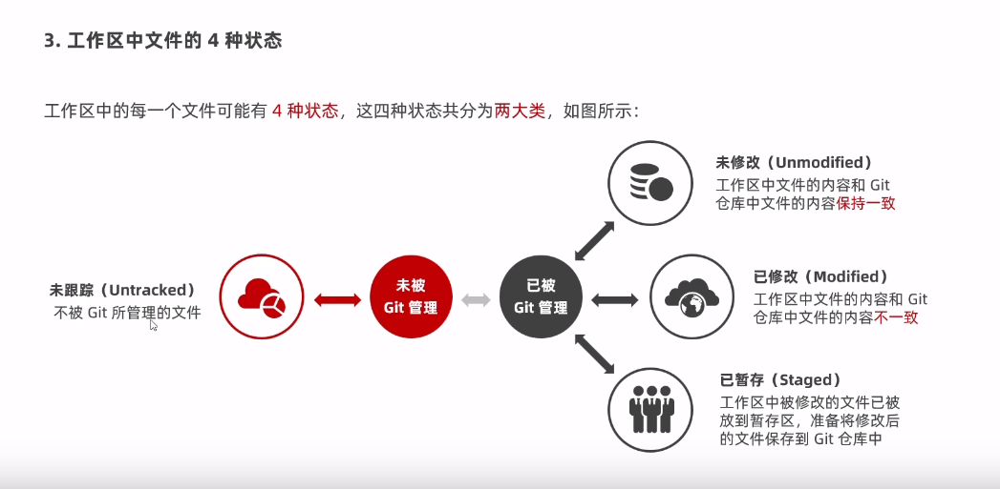

## 配置指令
```javascript
git config --global user.name "用户名"
git config --global user.email "邮箱地址"

// 查看所有全局配置项
git config --list --global

// 查看特定配置项
git config user.name

// git init 将当前目录转化为Git仓库
git init

// git status -s 以精简的方式显示文件的状态
git status -s 

// git add 有三个功能 ① 可以开始跟踪新文件 ② 把以跟踪的、且以修改的文件放到暂存区 ③ 把有冲突的文件标记为已解决状态
git add

// git add . 将多个文件加入暂存区
git add .

// git commit -m "提交消息" 将暂存区中的文件的快照，提交到Git仓库中进行保存
git commit -m "提交消息"

// git reset HEAD 要移除的文件名称 将暂存区的文件移除
git reset HEAD .

// git commit -a -m "提交消息" 直接是工作区->Git仓库
git commit -a -m "提交消息"

```
## 文件的四种状态

